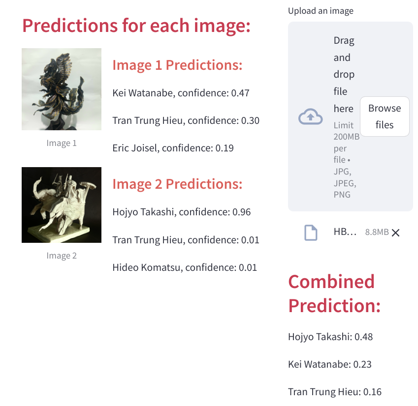

# Origami Style Classification

## Project Overview
I tried to build a deep learning model to classify origami styles and determine which origamist's folding techniques are most similar to my folding style.

## Features
- **Image Processing**: Background removal and preprocessing using U-Net.
- **Deep Learning Model**: A ResNet-based classification model with transfer learning.
- **Dataset Collection**: Scraped origami model images from various websites.
- **Interface**: Deployed as a simple web application using Streamlit.

## Resources:
- Find all the dataset here: [Dataset](https://www.kaggle.com/datasets/caokhoihuynh/orgami-works-of-some-origamists)
- The code for the preprocessing step and the model here: [Code](https://www.kaggle.com/datasets/caokhoihuynh/orgami-works-of-some-origamists/code)
- The deployed model and app here: [App](https://huggingface.co/spaces/Bonkh/Origami-prediction)

This is the normal UI of the app 

When you upload an image, the model will return top 3 origamists your model style is the most similar and the confidence level:

The final prediction is the combination of result of all uploaed image:

